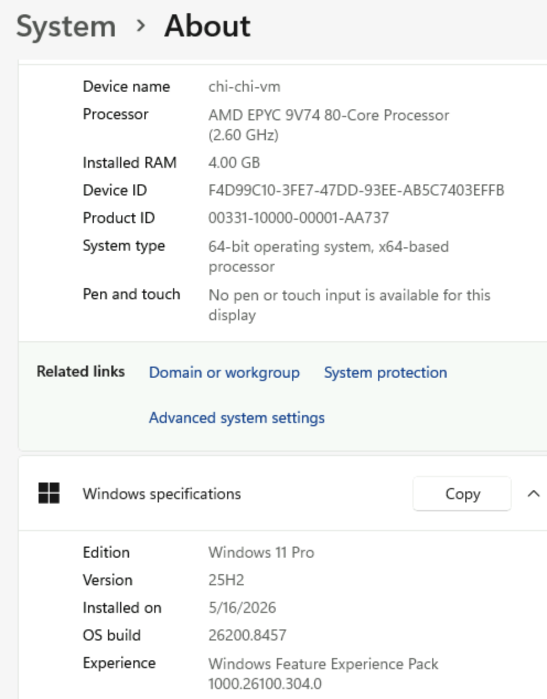
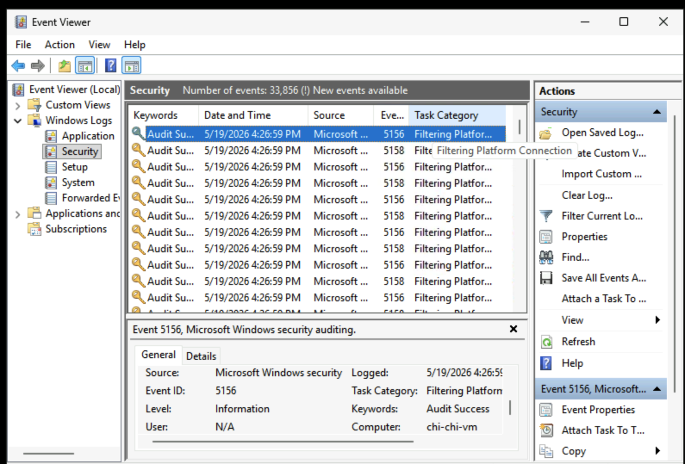
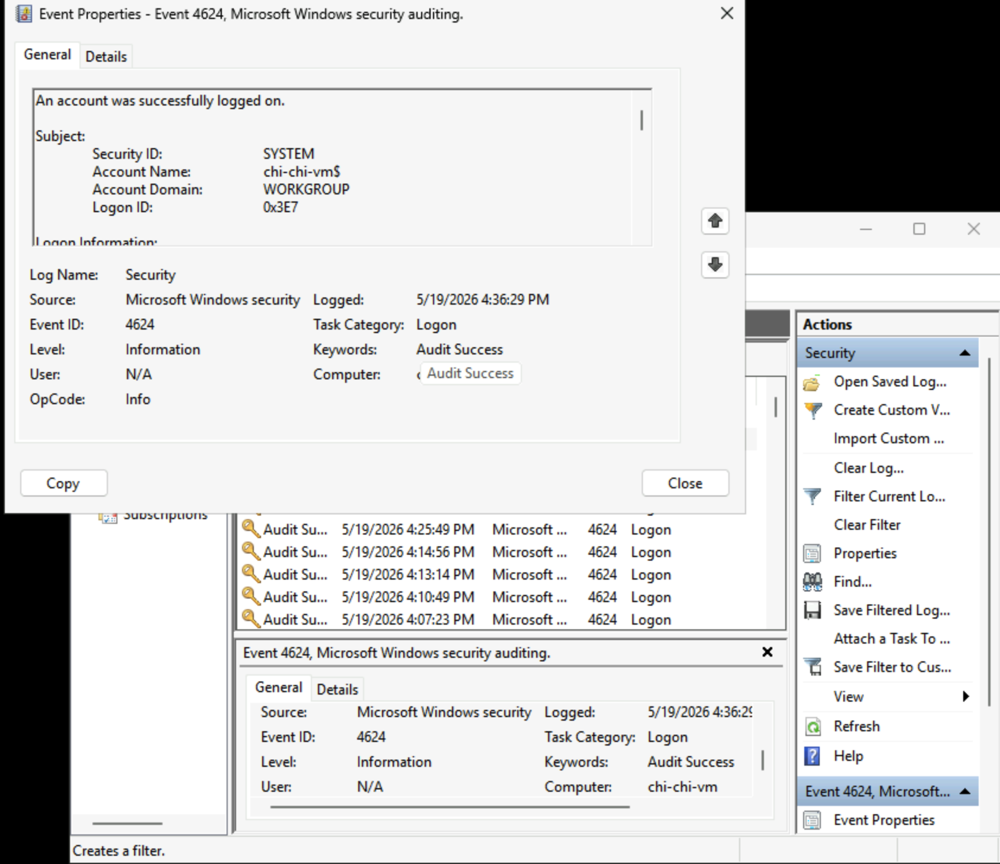
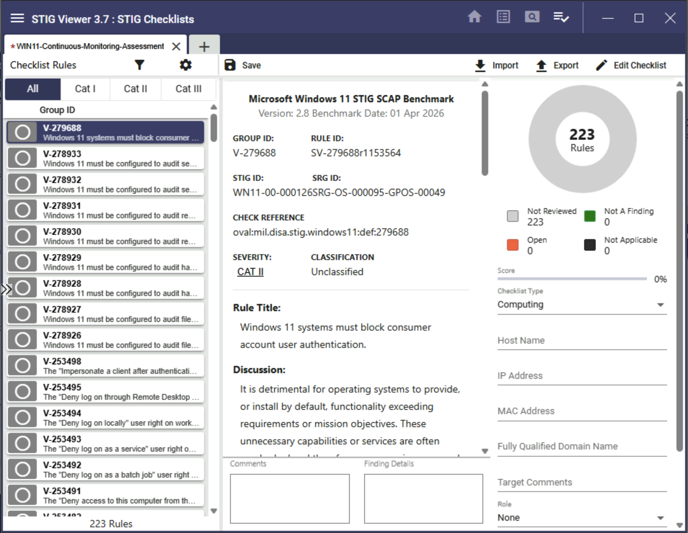
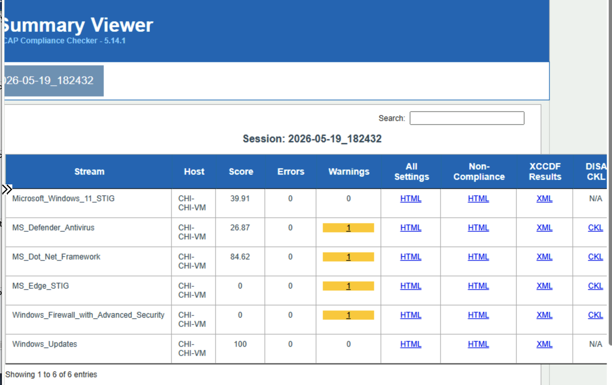
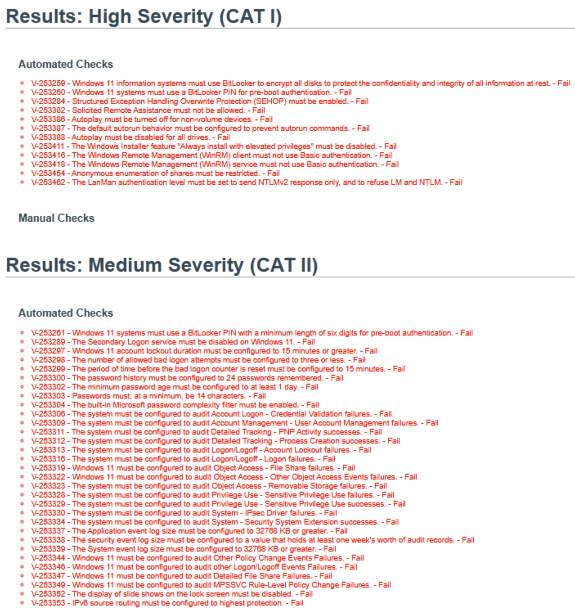
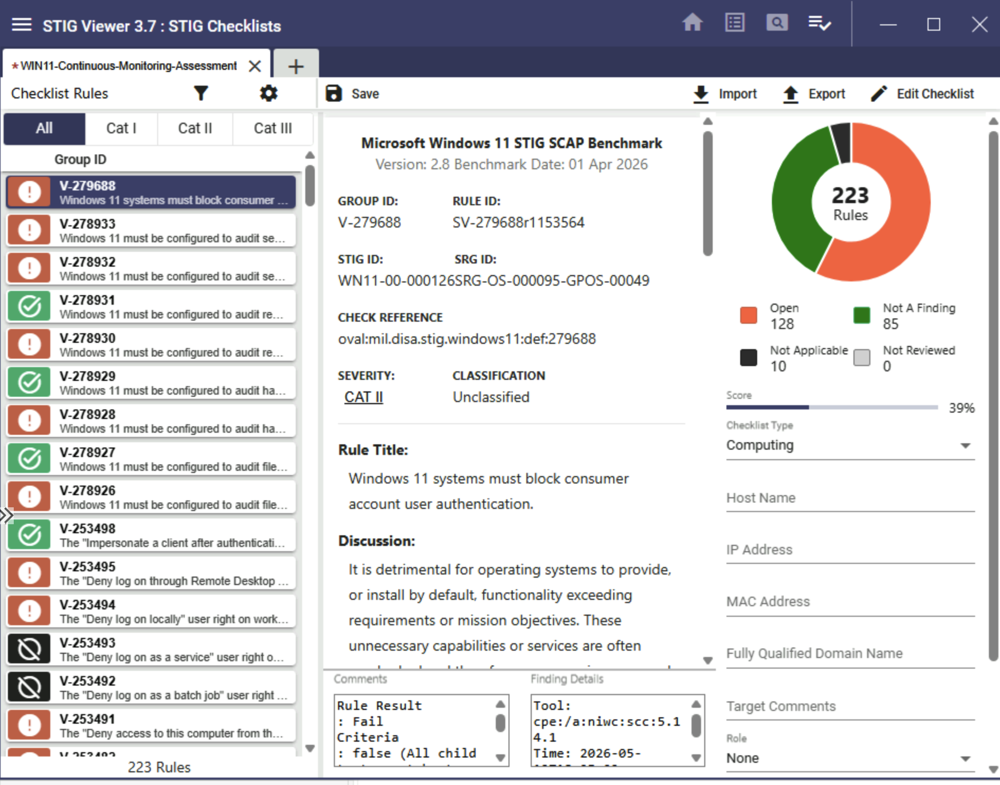
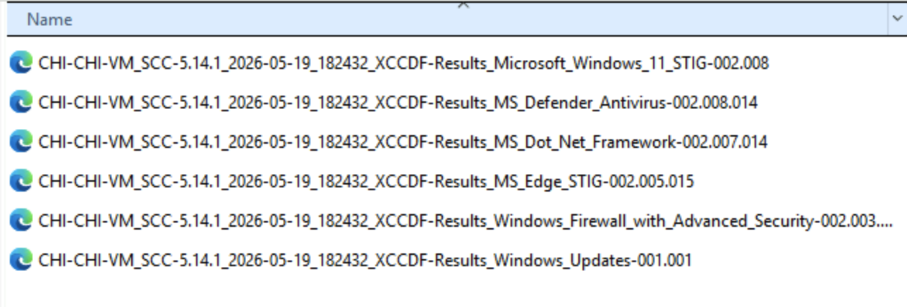
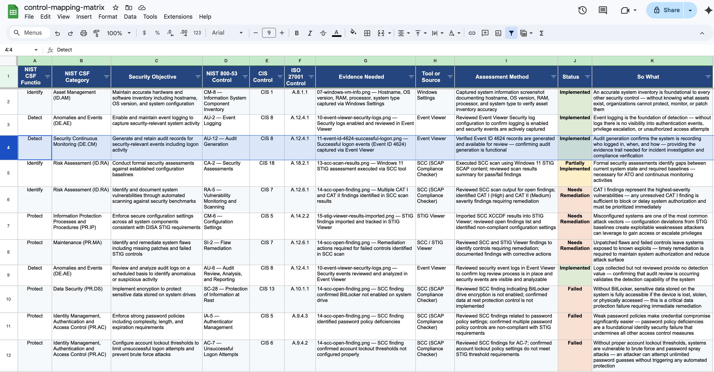
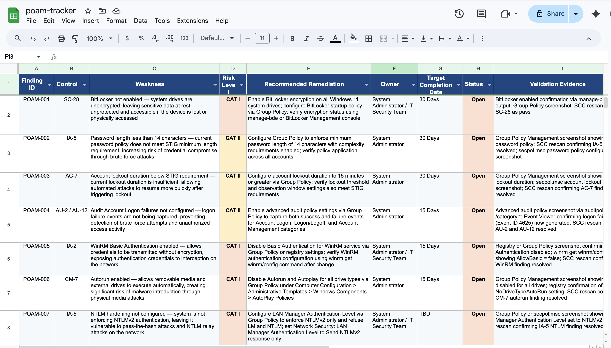

# NIST CSF Control Mapping Lab

## Overview

This project demonstrates a simulated cybersecurity compliance assessment aligned with:

- NIST Cybersecurity Framework (CSF)
- NIST Risk Management Framework (RMF)
- NIST SP 800-53
- DISA STIG Methodologies

The lab focuses on:

- Security control validation
- SCC compliance scanning
- STIG checklist analysis
- Audit log review
- Gap assessment documentation
- POA&M remediation tracking
- Continuous monitoring activities

The assessment was performed against a Windows 11 virtual machine using SCC and STIG Viewer.

---

# Key Findings Summary

| Finding | Severity | Related Control | Evidence |
|---|---|---|---|
| BitLocker encryption was not enabled | CAT I | SC-28 | SCC Open Findings |
| Weak password policy settings were identified | CAT II | IA-5 | SCC Open Findings |
| Audit logging gaps were identified | CAT II | AU-2 / AU-12 | Event Viewer and SCC Results |
| Account lockout settings did not meet benchmark requirements | CAT II | AC-7 | SCC Open Findings |
| WinRM authentication weaknesses were identified | CAT I | IA-2 / AC-17 | SCC Open Findings |

## So What

These findings show that the Windows 11 VM had configuration weaknesses that could increase the risk of unauthorized access, weak authentication, insufficient logging, and data exposure. The findings were documented, mapped to controls, and tracked through the POA&M process.

---

# Assessment Objectives

The purpose of this assessment was to:

- Identify security control gaps
- Validate audit logging configurations
- Perform STIG compliance analysis
- Map findings to NIST 800-53 controls
- Track remediation activities
- Demonstrate RMF continuous monitoring processes

---

# Technologies and Tools Used

| Tool | Purpose |
|---|---|
| Windows 11 Pro VM | Assessment target |
| SCAP Compliance Checker (SCC) | Automated STIG compliance scanning |
| STIG Viewer 3.7 | STIG checklist review and analysis |
| Windows Event Viewer | Audit log validation |
| GitHub | Documentation and evidence repository |

---

# Assessment Workflow

This lab follows a simplified RMF continuous monitoring workflow:

```text
Windows 11 VM Identification
↓
Audit Logging Review
↓
Authentication Event Validation
↓
STIG Checklist Creation
↓
SCC Compliance Scan
↓
Open Finding Review
↓
STIG Viewer Import
↓
Control Mapping
↓
POA&M Tracking
↓
Gap Assessment Summary
```

## So What

This workflow demonstrates how technical evidence is collected, assessed, mapped to security controls, and converted into remediation actions.

---

# Assessment Environment

The assessment environment consisted of a Windows 11 virtual machine configured for STIG validation and continuous monitoring activities.

## Windows VM Information

The following system information was documented during the assessment:

- Hostname
- Windows edition
- OS version
- System type
- Processor
- RAM allocation



### Related Controls

- CM-8 — System Component Inventory
- CA-2 — Security Assessments
- CM-6 — Configuration Settings

---

# Audit Logging Validation

Audit logging was reviewed to validate that security-relevant events were being captured properly.

The review included:

- Security log validation
- Event monitoring
- Authentication tracking
- Audit policy review

## Windows Security Event Logs

Security logs were reviewed through Windows Event Viewer.



### Related Controls

- AU-2 — Event Logging
- AU-6 — Audit Review
- AU-12 — Audit Generation

### So What

Audit logging is critical for:
- detecting suspicious activity
- supporting incident response
- validating accountability
- enabling forensic investigations

Without audit logging, organizations lose visibility into malicious or unauthorized behavior.

---

# Authentication Monitoring

Event ID 4624 successful logon events were validated to confirm authentication logging was functioning properly.

## Event ID 4624 Review



### Related Controls

- AU-2 — Event Logging
- AC-7 — Unsuccessful Logon Attempts
- IA-5 — Authenticator Management

### So What

Authentication logs help security teams:
- identify unauthorized access
- detect brute-force activity
- monitor user behavior
- support investigations

---

# STIG Checklist Creation

A Windows 11 STIG checklist was created using STIG Viewer.

The checklist imported the Windows 11 SCAP benchmark and categorized findings by:

- CAT I
- CAT II
- CAT III

## STIG Checklist



### Related Controls

- CA-2 — Security Assessments
- RA-5 — Vulnerability Monitoring
- CM-6 — Configuration Settings

---

# SCC Compliance Scan

SCAP Compliance Checker (SCC) was used to perform automated compliance validation against the Windows 11 STIG benchmark.

The SCC scan evaluated:
- audit configurations
- password policies
- encryption settings
- account management controls
- logging requirements

## SCC Scan Results



### Assessment Results

| Metric | Result |
|---|---|
| Compliance Score | 39.91% |
| Total Rules Reviewed | 223 |
| Open Findings | 128 |
| Not A Finding | 85 |
| Not Applicable | 10 |

### Related Controls

- RA-5 — Vulnerability Monitoring
- CA-7 — Continuous Monitoring
- SI-2 — Flaw Remediation

### So What

The SCC scan identified multiple configuration weaknesses that could increase the likelihood of:
- unauthorized access
- weak authentication
- insufficient logging
- insecure configurations

---

# SCC Open Findings Analysis

The SCC report identified several CAT I and CAT II findings requiring remediation.

Examples included:
- BitLocker disabled
- weak password policies
- insufficient audit configurations
- WinRM authentication weaknesses
- autorun enabled

## Open Findings



### Related Controls

- SC-28 — Protection of Information at Rest
- IA-5 — Authenticator Management
- AU-2 — Event Logging
- AC-7 — Unsuccessful Logon Attempts

### So What

Open STIG findings represent security gaps that increase organizational risk exposure and reduce compliance posture.

---

# STIG Viewer Import and Analysis

The SCC scan results were imported into STIG Viewer for centralized checklist analysis and remediation tracking.

## Imported STIG Results



### Findings Overview

| Status | Count |
|---|---|
| Open | 128 |
| Not A Finding | 85 |
| Not Applicable | 10 |

### Related Controls

- CA-2 — Security Assessments
- CA-7 — Continuous Monitoring
- RA-5 — Vulnerability Monitoring

### So What

STIG Viewer supports:
- structured compliance validation
- remediation tracking
- assessment documentation
- audit preparation

---

# SCC Generated Assessment Artifacts

The SCC scan generated multiple compliance artifacts and result files.

These included:
- XCCDF results
- HTML reports
- non-compliance reports
- configuration assessment outputs

## SCC Generated Files



### So What

Assessment artifacts provide:
- audit evidence
- assessment traceability
- compliance documentation
- remediation support

---

# Control Mapping Documentation

Assessment findings were mapped to NIST SP 800-53 security controls.

The mapping matrix includes:
- control identifiers
- assessment evidence
- related findings
- implementation status
- remediation considerations

## Control Mapping Matrix Preview

The screenshot below demonstrates how technical findings were mapped to NIST SP 800-53 controls and associated evidence sources.



## Full Control Mapping Matrix

[Control Mapping Matrix](control-mapping-matrix.xlsx)

### Example Controls Mapped

- AU-2
- AU-6
- AU-12
- CM-8
- RA-5
- SI-2
- SC-28
- IA-5
- AC-7

### So What

Control mapping demonstrates how technical findings align with governance and compliance requirements.

This activity supports:
- RMF assessments
- audit readiness
- compliance validation
- continuous monitoring

---

# POA&M Tracking

A POA&M tracker was created to document remediation activities for identified weaknesses.

The POA&M includes:
- finding descriptions
- severity levels
- remediation actions
- milestones
- target completion dates
- status tracking

## POA&M Tracker Preview

The screenshot below demonstrates how identified weaknesses and remediation activities were documented and tracked throughout the assessment lifecycle.



## Full POA&M Tracker

[POA&M Tracker](poam-tracker.xlsx)

### So What

POA&M management helps organizations:
- prioritize remediation
- reduce risk exposure
- track corrective actions
- improve compliance posture

---

# Gap Assessment Summary

A formal gap assessment summary was developed to document:
- compliance deficiencies
- operational risks
- remediation recommendations
- assessment conclusions

## Gap Assessment

[Gap Assessment Summary](gap-assessment-summary.md)

### So What

Gap assessments help organizations understand:
- current security posture
- areas requiring improvement
- operational risk exposure
- remediation priorities

---

# RMF Alignment

This assessment supports several RMF lifecycle activities.

| RMF Step | Activity |
|---|---|
| Categorize | Identify systems and assets |
| Select | Identify applicable controls |
| Implement | Configure safeguards |
| Assess | Perform SCC and STIG analysis |
| Authorize | Support risk-based decisions |
| Monitor | Track findings and remediation |

---

# How To Explain This Project

This project demonstrates a simulated RMF continuous monitoring and control mapping workflow. I assessed a Windows 11 VM using SCC, STIG Viewer, and Event Viewer. I validated audit logs, reviewed authentication events, ran a Windows 11 STIG compliance scan, identified CAT I and CAT II findings, mapped those findings to NIST SP 800-53 controls, and documented remediation actions in a POA&M tracker.

## Why This Matters

The purpose of this lab was to show how technical security findings become governance artifacts. In a real organization, these findings would support audit readiness, risk management, remediation tracking, and continuous monitoring activities.

---

# Skills Demonstrated

This project demonstrates practical experience with:

- NIST CSF
- RMF processes
- STIG compliance assessments
- SCC scanning
- Audit log analysis
- Security control mapping
- POA&M management
- Continuous monitoring
- Vulnerability assessment activities
- Governance documentation

---

# Future Improvements

Future enhancements may include:

- Nessus vulnerability scanning
- SIEM integration
- PowerShell audit automation
- centralized log aggregation
- remediation validation rescans
- CIS benchmark comparisons

---

# Author

Gloria “Chinerey” Ukwu

Cybersecurity | ISSO | GRC | RMF | Continuous Monitoring
